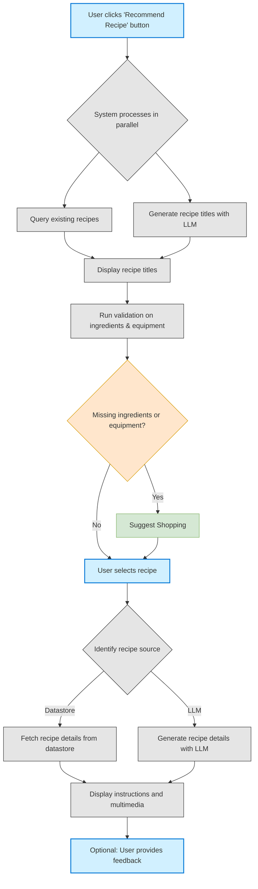

# Recipe Search & Selection Feature

## Introduction

The Recipe Search & Selection feature enables users to discover, view, and follow cooking recipes tailored to their specific needs and preferences. By leveraging both a curated database of existing recipes and dynamic LLM-generated content, the system provides personalized recommendations based on user-specified dietary restrictions, budget constraints, available ingredients, and kitchen equipment. This intelligent approach to recipe discovery simplifies meal planning while accommodating individual circumstances, allowing users to find appropriate recipes quickly and receive guidance on any missing requirements.

## Dependencies

### Required Dependencies
- **User Authentication System**
  - Active user account with unique identifier
  - Authentication tokens with appropriate permission levels
  - Session management capabilities

### Optional User Preference Dependencies

- **Dietary Preferences**
  - Type: `Array<String>`
  - Schema: `[preference_type, preference_value, preference_strength]`
  - Examples: `["restriction", "gluten-free", "strict"]`, `["preference", "low-carb", "moderate"]`

- **Budget Configuration**
  - Type: `Object`
  - Schema: `{currency: String, max_per_meal: Number, max_per_week: Number}`
  - Example: `{currency: "USD", max_per_meal: 15.00, max_per_week: 85.00}`

- **Ingredient Inventory**
  - Type: `Array<Object>`
  - Schema: `[{item_id: String, item_name: String, quantity: Number, unit: String, expiry_date: Date}]`
  - Example: `[{item_id: "i123", item_name: "chicken breast", quantity: 2, unit: "pound", expiry_date: "2025-04-10"}]`

- **Equipment Registry**
  - Type: `Array<Object>`
  - Schema: `[{equipment_id: String, equipment_name: String, quantity: Number}]`
  - Example: `[{equipment_id: "e456", equipment_name: "blender", quantity: 1}]`

- **Favorite Recipes**
  - Type: `Array<Object>`
  - Schema: `[{recipe_id: String, last_made: Date, rating: Number, notes: String}]`
  - Example: `[{recipe_id: "r789", last_made: "2025-03-15", rating: 4.5, notes: "Add more garlic next time"}]`

## Process

Here's a breakdown of the process:

1. **Initial Action**: The user starts by clicking the "Recommend Recipe" button.

2. **Parallel Processing**: The system works on two tracks simultaneously:
   - Querying the database for existing recipes
   - Using an LLM to generate new recipe titles

3. **Display & Validation**: After compiling options, the system:
   - Displays recipe titles to the user
   - Runs validation against the user's available ingredients and equipment
   - Suggests "Shopping" if items are missing

4. **Selection & Source Handling**: When the user selects a recipe, the system:
   - Identifies whether the recipe comes from the datastore or was generated by the LLM
   - Fetches or generates complete recipe details accordingly

5. **Presentation & Feedback**: Finally, the system:
   - Displays instructions and multimedia content
   - Provides an option for user feedback
