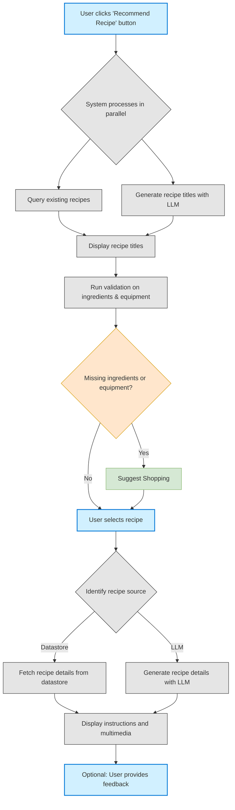

# Search, Select, and Follow Recipe

## Dependency
* [required] user account
* [optional] user's preferences: diet, budget
* [optional] user's ingredients: Array<(item,quantity,unit_of_measure)>
* [optional] user's equipment: Array<(item,quantity,unit_of_measure)>
* [optional] user's favourite recipes: Array<(item,quantity,unit_of_measure)>

## Steps

Here's a breakdown of the process:

1. **Initial Action**: The user starts by clicking the "Recommend Recipe" button.

2. **Parallel Processing**: The system works on two tracks simultaneously:
   - Querying the database for existing recipes
   - Using an LLM to generate new recipe titles

3. **Display & Validation**: After compiling options, the system:
   - Displays recipe titles to the user
   - Runs validation against the user's available ingredients and equipment
   - Suggests "Shopping" if items are missing

4. **Selection & Source Handling**: When the user selects a recipe, the system:
   - Identifies whether the recipe comes from the datastore or was generated by the LLM
   - Fetches or generates complete recipe details accordingly

5. **Presentation & Feedback**: Finally, the system:
   - Displays instructions and multimedia content
   - Provides an option for user feedback
